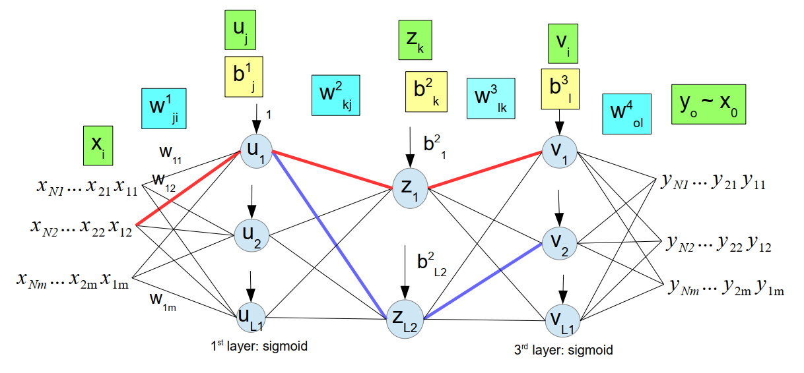

# Autoencoder
The autoencoder encode the input *X* into the lower dimension *z*, and then decodes to *y~x*. 

## Architecture
    - 1st and 3rd layers: sigmoid
    - 2nd and 4th layers: no activation function
    - Cost function: MSE
    - Equal number of neurons in 1st and 3rd layers

## Features
    - Early stopping
    - Variable gradient descent learning rate
    - Momentum (set eta > 0 to enable)
    - Update one layer weights individually, then all layers simultaneously
    - Plot MSE vs iteration (uncomment to save plot)
    - Derivatives computed in matrix notation and loop

## Backpropagation
Derivatives calculation available at [https://github.com/vivamoto/Classifier/blob/master/Neural%20Network%20Derivatives.pdf]

Example code at the end of the file.

## Reference
Lecture from Prof Clodoaldo Lima
