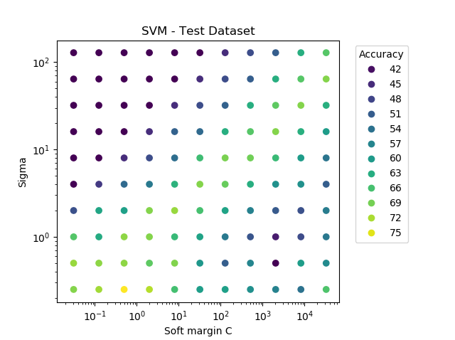

## Support Vector Machines (SVM)
Python and NumPy implementation from scratch of three SVM models for classification.

Normalize numerical values of X using min-max or z-score before predicting.  
Convert categorical values to numeric.  
All methods converts Y ∈ {-1, 1} and returns Y ∈ {0, 1}.  
Use one-hot coding of Y for multiclass.  

Sample code at the end of the file.

## RBF kernel tune with grid search and cross validation

## Features
Available models:  
- traditional SVM  
- Twin SVM (TW-SVM)  
- Least Squares SVM (LS-SVM)  

Multiclass options:  
- One versus One  
- One versus All  

Kernel types:  
- linear, polynomial, rbf, erbf, hyperbolic tangent (tanh), linear splines  

QP solver options:  
- cvxopt
- SciPy optimize  

RBF kernel tuning:  
- soft margin
- sigma  

### Commonly used parameters  
| Parameter | Description |
|-----------|-------------|
|	X_train |         Train set, numerical values normalized with min-max or z-score. Convert categorical values to numeric before use.|
| y_train |         Train set, one-hot encoded. Y ∈ {-1, 1} or ∈ {0, 1} |
|	X_test  |         Test set, numerical values normalized with min-max or z-score. Convert categorical values to numeric before use.|
| y_test  |         Test set, one-hot encoded. Y ∈ {-1, 1} or ∈ {0, 1} |
|	model|            One of 'svm', 'lssvm', 'twsvm'.|
|	y_hat|            Predicted values.|
|	kernel|           One of 'linear', 'poly', 'rbf', 'erbf', 'tanh', 'lspline'|
|	K|                Number of cross validation folds|
|	tune|             (boolean) tune RBF kernel parameters soft margin and sigma.|
|	plot|             (boolean) create plots.|
|	pdir|             Directory to save the plots.|
|	DS_name|          Dataset name used in plot title and filename. Do not include spaces.|

## Reference
Committee machines: a unified approach using support vector machines  
Clodoaldo Aparecido de Moraes Lima

Twin Support Vector Machines for Pattern Classification  
Jayadeva - Reshma Khemchandani - Suresh Chandra  
https://ieeexplore.ieee.org/document/4135685  

Twin Support Vector Machines - Models, Extensions and Applications  
Jayadeva - Reshma Khemchandani - Suresh Chandra  
https://www.springer.com/gp/book/9783319461847  

Quadratic Programming with Python and CVXOPT  
https://cvxopt.org/  
https://web.archive.org/web/20140429090836/http://www.mblondel.org/journal/2010/09/19/support-vector-machines-in-python/  
https://sandipanweb.wordpress.com/2018/04/23/implementing-a-soft-margin-kernelized-support-vector-machine-binary-classifier-with-quadratic-programming-in-r-and-python/  

A Comparison of Methods for Multi-class Support Vector Machines  
Chih-Wei Hsu and Chih-Jen Lin  

A Practical Guide to Support Vector Classification.  
C.-W.. Hsu, C.-C. Chang, C.-J. Lin (2016).  
https://www.csie.ntu.edu.tw/~cjlin/papers/guide/guide.pdf  
